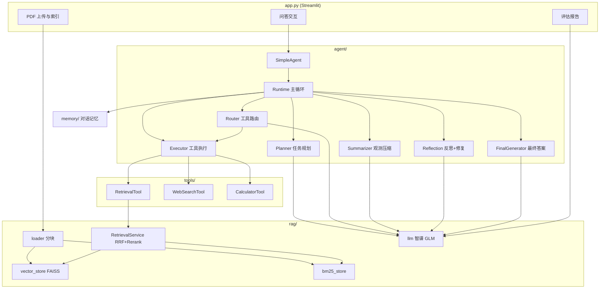

# 基于 Agent 的智能问答系统

基于 **混合检索 RAG** 与 **Task-Oriented Agent** 的智能问答系统。用户上传 PDF 后，系统通过 Planner → Router → Tool → Reflection 流水线完成文档问答、联网查询与数值计算，并支持 LLM-as-a-Judge 评估。

---

## 功能特性

- **混合检索 RAG**：BM25 关键词检索 + 稠密向量检索 + RRF 融合，可选 BGE Reranker 重排序
- **Task-Oriented Agent v1.2**：按任务目标规划、动态选工具、结构化反思与计划修复
- **三种工具**：本地文档检索（`retrieval`）、网络搜索（`web_search`）、安全计算器（`calculator`）
- **对话记忆**：多轮对话上下文，Planner 可引用历史
- **Query Rewrite**：检索前 LLM 改写查询，提升召回
- **LLM 评估模式**：Faithfulness / Answer Relevancy / Context Utilization 三维打分
- **内存守卫**：低内存环境下拒绝加载模型，避免系统卡死

---

## 系统架构



### Agent 执行流程

```
用户问题
  → Initializer（读取 Memory，生成 Plan）
  → 循环每个 Task：
      Router（选 Tool + 构造参数）
        → information_collection：LLM 在 retrieval / web_search 间选择
        → computation：CalculatorRouter 从依赖 TaskResult 自动生成表达式
      Executor（校验参数、执行 Tool、瞬态错误重试）
      Summarizer（压缩 Raw Observation）
      Reflection（判 status / plan_repair → ResultBuilder 结构化 output）
      Plan Repair（重试、换 Tool、插入新 Task）
  → FinalGenerator（TaskResult → 最终答案，带单位格式化）
  → 写入 Memory
```

---

## 项目结构

```
RagProject/
├── app.py                      # Streamlit 入口
├── config.py                   # 全局配置（模型路径、检索参数、内存阈值）
├── requirements.txt
│
├── agent/                      # Task-Oriented Agent
│   ├── simple_agent.py         # Agent 入口，组装 Runtime
│   ├── state.py                # 运行时状态（Plan、ObservationBuffer、KB 上下文）
│   ├── trace.py                # 执行 Trace 日志
│   ├── plan_utils.py           # 前置 Task 输出格式化
│   ├── planning/               # Planner：任务规划
│   │   ├── planner.py
│   │   ├── prompt.py
│   │   └── schema.py           # Plan / Task / TaskResult / PlanRepair
│   ├── runtime/                # 运行时核心
│   │   ├── runtime.py          # 主循环
│   │   ├── initializer.py      # Memory → State → Plan
│   │   ├── router.py           # Task → Tool 路由
│   │   ├── routing_utils.py    # 泛用选型指引（本地 KB vs 实时信息）
│   │   ├── calculator_router.py# 计算任务表达式生成
│   │   ├── executor.py         # Tool 执行与重试
│   │   ├── summarizer.py       # Observation 压缩
│   │   ├── final_generator.py  # 最终答案生成
│   │   ├── price_utils.py      # 价格提取、单位推断与格式化
│   │   ├── retry_utils.py      # 瞬态网络错误判断
│   │   └── observation_buffer.py
│   └── reflection/             # 反思与结构化结果
│       ├── reflection.py
│       ├── result_builder.py   # Summary → TaskResult.output
│       └── prompt.py
│
├── rag/                        # 检索增强生成
│   ├── loader.py               # PDF 加载与分块
│   ├── embedding.py            # BGE-M3 嵌入
│   ├── vector_store.py         # FAISS 向量库
│   ├── bm25_store.py           # BM25 索引（jieba 分词）
│   ├── retriever.py            # RRF 融合
│   ├── reranker.py             # BGE Reranker
│   ├── retrieval_service.py    # 检索编排
│   ├── llm.py                  # 智谱 GLM 统一调用
│   ├── evaluator.py            # LLM-as-a-Judge 评估
│   ├── prompts.py              # 评估 Prompt
│   └── utils.py                # 内存管理、JSON 解析
│
├── tools/                      # Agent 工具
│   ├── registry.py             # Tool 注册与 Schema
│   ├── retrieval_tool.py       # 本地知识库检索
│   ├── web_search_tool.py      # Tavily 网络搜索
│   └── calculator_tool.py      # AST 安全计算器
│
├── memory/                     # 对话记忆
│   ├── base_memory.py
│   └── conversation_memory.py
│
└── services/
    └── query_rewriter.py       # 检索 Query 改写
```

---

## 快速开始

### 1. 环境准备

```bash
python -m venv .venv
source .venv/bin/activate   # Windows: .venv\Scripts\activate
pip install -r requirements.txt
```

### 2. 环境变量

| 变量 | 说明 | 必需 |
|------|------|------|
| `ZHIPU_API_KEY` | 智谱 AI API Key（LLM、评估、Query Rewrite） | 是 |
| `TAVILY_API_KEY` | Tavily 搜索 API Key（联网搜索） | 使用 web_search 时需要 |

```bash
export ZHIPU_API_KEY="your-zhipu-api-key"
export TAVILY_API_KEY="your-tavily-api-key"
```

> 建议在 `config.py` 中通过环境变量读取 Key，不要将 Key 提交到版本库。

### 3. 模型（可选，本地加速）

默认从 HuggingFace 在线加载。若需离线或加速，将模型放到以下路径：

```
models/
├── embedding/bge-m3/
└── reranker/bge-reranker-base/
```

本地模型存在时自动优先使用，否则回退到 `BAAI/bge-m3` 和 `BAAI/bge-reranker-base`。

### 4. 启动

```bash
streamlit run app.py
```

浏览器打开后：

1. 上传 PDF 文档（首次加载约 30 秒，会构建 FAISS + BM25 索引）
2. 输入问题并发送
3. 侧边栏可切换「启用重排序」「LLM 评估模式」

---

## 工具选型逻辑

Router 根据**信息来源类型**（而非具体领域关键词）选择 Tool：

| 场景 | 优先 Tool |
|------|-----------|
| 本地 PDF 已加载，查询文档内概念/方法/术语/论文对比 | `retrieval` |
| 实时价格、最新新闻、明确需要联网的公开数据 | `web_search` |
| 先查价格再计算（如「月费减少 20% 后多少钱」） | Task #1 `web_search` → Task #2 `calculator` |

本地知识库可用时，系统会通过 `local_kb_available` 与 `routing_utils` 引导 Router 优先检索用户上传的文档。

---

## 配置说明

主要配置项见 `config.py`：

| 配置 | 默认值 | 说明 |
|------|--------|------|
| `LLM_MODEL` | `glm-4-flash` | 智谱 LLM 模型 |
| `CHUNK_SIZE` / `CHUNK_OVERLAP` | 1200 / 150 | 文档分块 |
| `VECTOR_K` / `BM25_K` | 5 / 5 | 单路检索 Top-K |
| `FUSED_TOP_K` | 10 | RRF 融合后保留数 |
| `FINAL_TOP_K` | 3 | 最终返回文档数 |
| `MIN_AVAILABLE_MEMORY_MB` | 800 | 内存守卫阈值（MB） |
| `EMBEDDING_BATCH_SIZE` | 4 | 嵌入批次（越小越省内存） |

---

## 评估模式

侧边栏开启「LLM 评估模式」后，每次问答会记录 question / answer / contexts。点击「运行评估」可得到：

- **Faithfulness**（40%）：答案是否忠实于检索上下文
- **Answer Relevancy**（35%）：答案与问题的相关度
- **Context Utilization**（25%）：上下文利用程度

---

## 技术栈

- **UI**：Streamlit
- **LLM**：智谱 GLM-4-Flash（`zhipuai`）
- **Embedding / Reranker**：BGE-M3、BGE-Reranker-Base
- **向量库**：FAISS（`langchain-community`）
- **稀疏检索**：BM25（`rank-bm25` + jieba）
- **网络搜索**：Tavily
- **PDF 解析**：PyMuPDF（`fitz`）

---

## 开发说明

- Agent 每次提问在 `app.py` 中重建，确保 `use_rerank` 等工具配置即时生效；对话 Memory 跨轮保留
- 执行 Trace 会打印到控制台，包含 Router 选型、Reflection 状态、Plan 变更等
- 瞬态网络错误在 Tool / Executor / Runtime 三层均有重试机制
